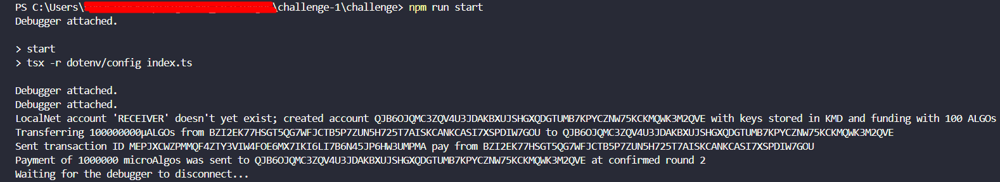

## Algorand Coding Challenge Submission

**What was the bug?**

<!-- Provide a clear and concise description of the bug. -->
the bug was that it was trying to send an unsigned transaction to the network, you need to first sign the transaction using the secret key of the sender account.

**How did you fix the bug?**

<!-- Explain the steps you took to fix the bug. -->
simply sign the transaction with the sender's secret key first and then send it to the network. 
const signedTxn = txn.signTxn(sender.sk);
await algodClient.sendRawTransaction(signedTxn).do();

**Console Screenshot:**

<!-- Attach a screenshot of your console showing the result specified in the README. -->

