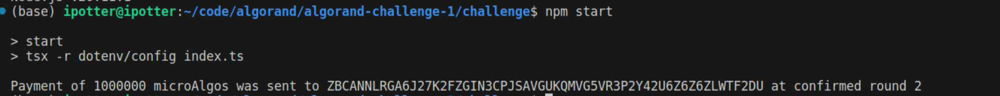

## Algorand Coding Challenge Submission

**What was the bug?**

<!-- Provide a clear and concise description of the bug. -->
First Problem is type error - Argument of type 'Transaction' is not assignable to parameter of type 'Uint8Array | Uint8Array[]'.

Second and main issue is `algodClient.sendRawTransaction()` expects a signed transaction.

**How did you fix the bug?**
By signing the transaction 
```
const signedTxn: Uint8Array = txn.signTxn(sender.sk)

await algodClient.sendRawTransaction(signedTxn).do();
```

**Console Screenshot:**
