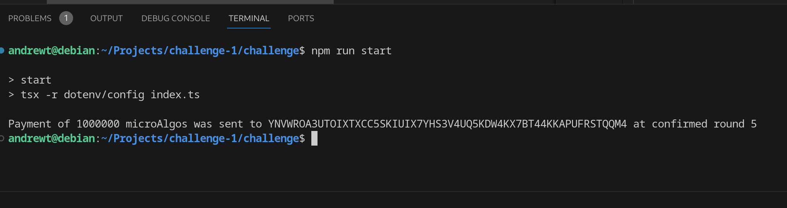

## Algorand Coding Challenge Submission

**What was the bug?**

<!-- Provide a clear and concise description of the bug. -->
`sendRawTransaction(...)` expects a `Uint8Array` or `Uint8Array[]`, however we were passing in an object of type `Transaction`.

Furthermore, according to documentation, `sendRawTransaction(...)` expects the `Uint8Array` parameter to be a signed transaction.

**How did you fix the bug?**

<!-- Explain the steps you took to fix the bug. -->
I signed the the `Transaction` object using the method `signTxn(sk: Uint8Array): Uint8Array` and passed its result, a `Uint8ARray` representing the signed transaction, into `sendRawTransaction(...)`.

**Console Screenshot:**

<!-- Attach a screenshot of your console showing the result specified in the README. -->
